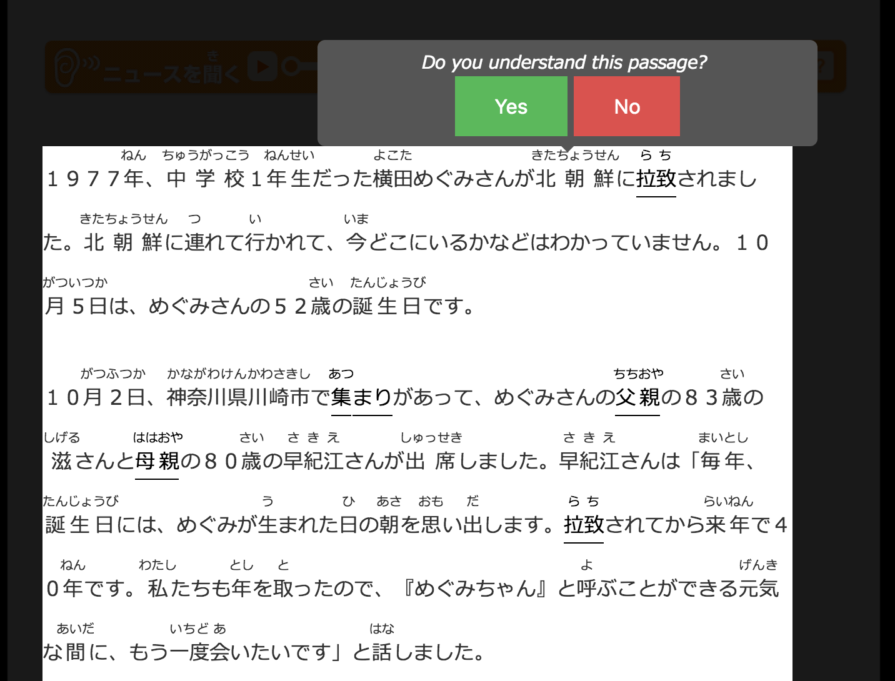

# Language Learning Tool Chrome Extension

This extension is part of a language learning tool for a project that Professor Erik Andersen and Ph.D. candidate Shuhan Wang is working on. 

The idea is for the extension to take users who are trying to learn Japanese to didactic adventure throughout the web, taking excerpts from actual articles from NHK and testing their knowledge... 

